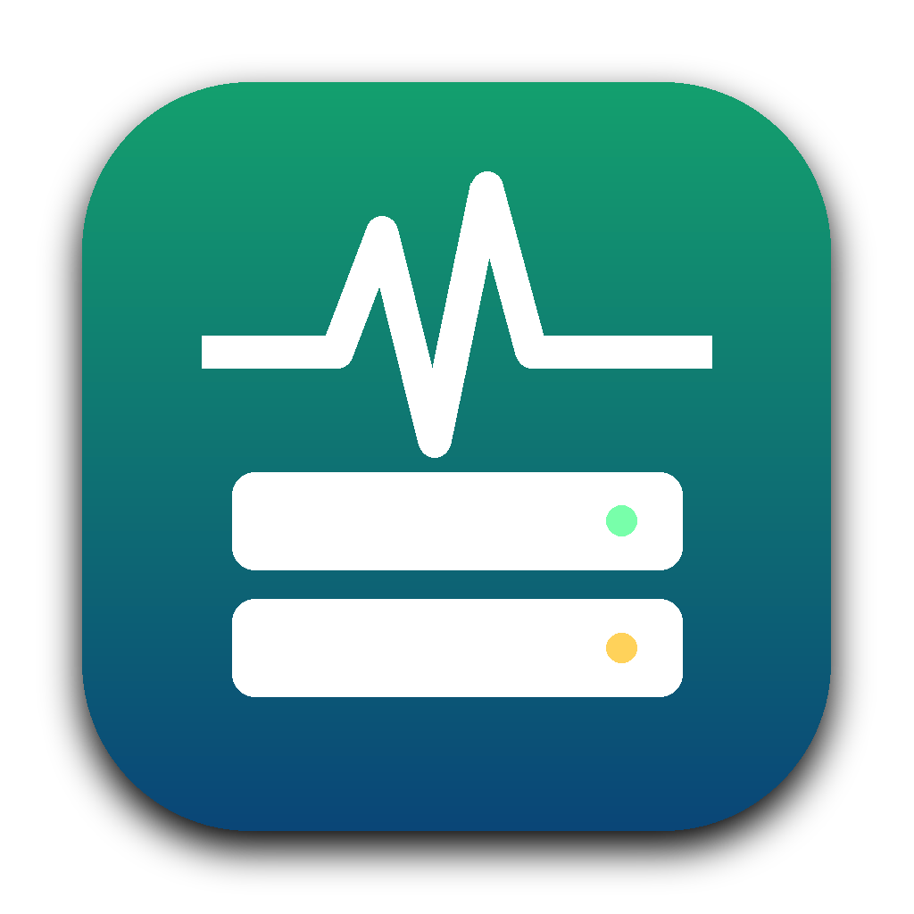
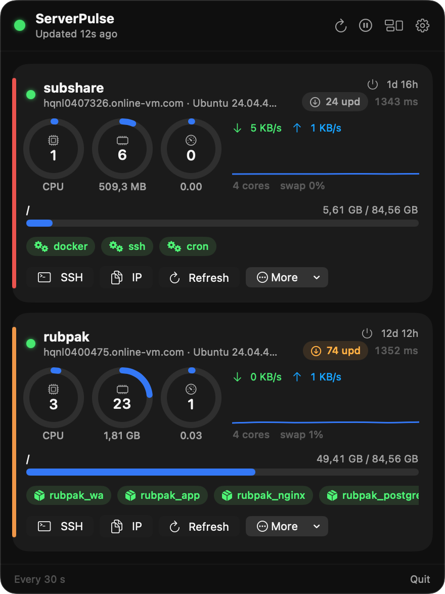
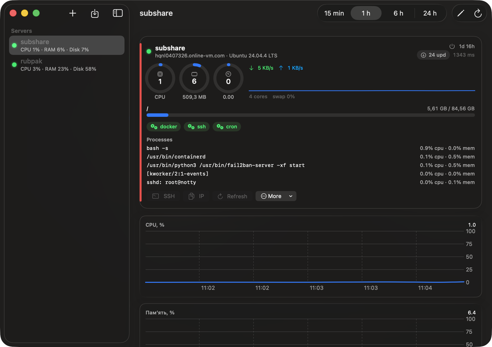
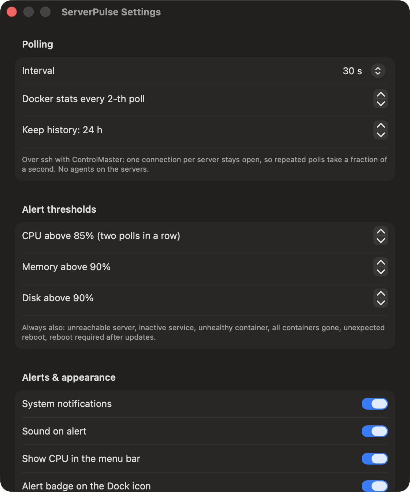

<p align="center">
  
</p>

<h1 align="center">ServerPulse</h1>

<p align="center">
  Menu-bar server monitor for macOS. Agentless, over plain SSH, with Liquid Glass UI.<br>
  <a href="README.uk.md">Українською</a>
</p>

<p align="center">
  
</p>

## What it does

ServerPulse lives in the menu bar and polls your Linux servers over SSH. No agents, no daemons, no open ports: it runs one shell script per poll through a persistent `ssh` ControlMaster connection, so after the first handshake each refresh takes a fraction of a second.

- **Menu bar window** with a glass card per server: CPU, memory and load gauges, disk bars, network rates, uptime, pending updates, reboot-required flag, RTT.
- **Docker and systemd at a glance.** Container chips turn red when a container is exited or unhealthy; systemd services you list are checked with `is-active`. Right-click a chip to restart, stop, start or read the last 60 log lines.
- **Dashboard window** with Swift Charts history for CPU, memory, load and network (15 min to 24 h), top processes and filtered journal warnings.
- **Alerts** with native notifications and an optional sound: server unreachable, CPU/memory above threshold on two consecutive polls, disk above threshold, service down, container unhealthy, all containers gone, unexpected reboot, reboot required.
- **Quick actions** on every card: open an SSH session in Terminal, open the website, copy the IP, show Docker status, disk & memory, journal errors, available updates, prune the build cache, reboot with confirmation. Add your own per-server quick commands.
- **Import from `~/.ssh/config`** in one click. Host aliases, ports, users and identity files are picked up as is.
- Ukrainian and English UI, launch at login, adjustable interval and thresholds, per-server log filter (default hides `UFW BLOCK` noise).

<p align="center">
  
</p>

## Install

Download `ServerPulse-x.y.z.dmg` from [Releases](https://github.com/v1rus91/ServerPulse/releases), drag the app to Applications and launch it. The app is signed ad hoc, so on the first launch right-click it and choose Open.

Requirements: macOS 14 or newer (Liquid Glass effects on macOS 26), `ssh` key-based access to your servers (no password prompts), Linux hosts with `/proc`, `df`, `ps`. Docker and systemd checks are optional and skipped when absent.

## Build from source

Only the Command Line Tools are needed, no Xcode.

```bash
git clone https://github.com/v1rus91/ServerPulse.git
cd ServerPulse
./packaging/build.sh          # builds dist/ServerPulse.app and the DMG
.build/release/ServerPulse --probe   # polls every host from ~/.ssh/config and prints a summary
```

Useful launch flags: `--dashboard` opens the dashboard immediately, `--settings` opens Settings, `--import` imports hosts from `~/.ssh/config` and exits.

## How it works

Every poll sends a small bash script over `ssh -o ControlMaster=auto -o ControlPersist=180`. The script prints sections such as `/proc/stat`, `/proc/meminfo`, `df`, `/proc/net/dev`, `docker ps`, `systemctl is-active` and `journalctl -p warning`. CPU usage and network rates come from the deltas between polls, or from a one-second sample inside the script on the first poll. Docker stats, which are slow, run only every N-th poll.

Data is stored in `~/Library/Application Support/ServerPulse`. Nothing leaves your Mac except the SSH sessions to your own servers.

<p align="center">
  
</p>

## License

MIT
