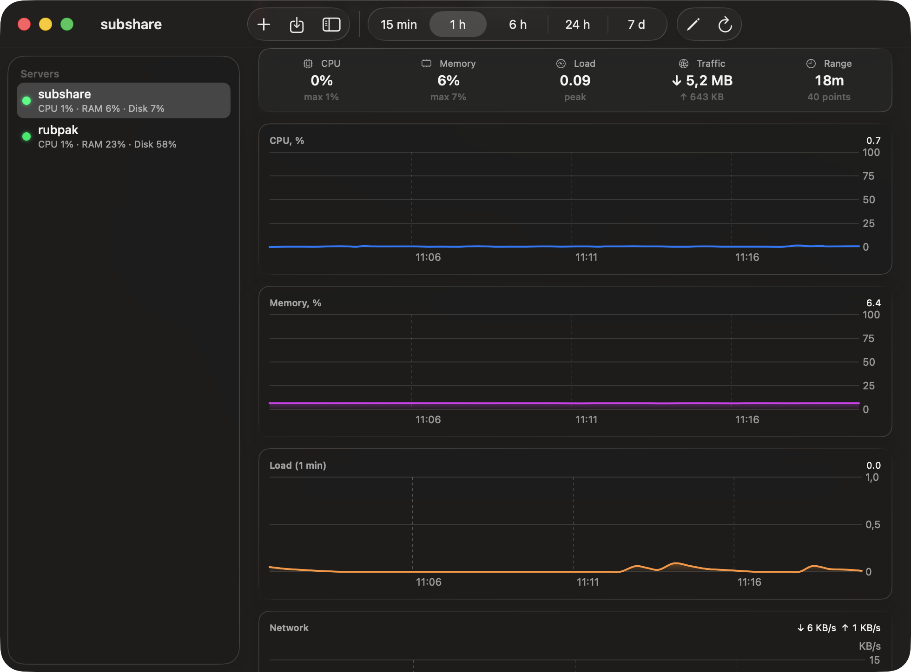

<p align="center">
  
</p>

<h1 align="center">ServerPulse</h1>

<p align="center">
  Монітор серверів у рядку меню macOS. Без агентів, через звичайний SSH, з інтерфейсом Liquid Glass.<br>
  <a href="README.md">English</a>
</p>

<p align="center">
  
</p>

## Що вміє

ServerPulse живе в рядку меню й опитує ваші Linux-сервери через SSH. Жодних агентів, демонів чи відкритих портів: на кожне опитування виконується один shell-скрипт через постійне зʼєднання `ssh` ControlMaster, тож після першого handshake оновлення займає частки секунди.

- **Вікно з рядка меню** зі скляною карткою на кожен сервер: кільця CPU, памʼяті й load, смуги дисків, швидкість мережі, аптайм, кількість оновлень, ознака потрібного ребуту, RTT.
- **Docker і systemd одним поглядом.** Чипи контейнерів червоніють, якщо контейнер зупинений або unhealthy; перелічені вами systemd-сервіси перевіряються через `is-active`. Правий клік по чипу: перезапустити, зупинити, запустити або прочитати останні 60 рядків логу.
- **Дашборд** із графіками Swift Charts для CPU, памʼяті, load і мережі (від 15 хв до 7 днів) з підсумком за період (середнє й пік CPU і памʼяті, пік load, сумарний трафік), топ процесів і відфільтрований журнал.
- **Тривоги** з нативними сповіщеннями та звуком: сервер недоступний, CPU/памʼять вище порогу два опитування поспіль, диск вище порогу, сервіс не працює, контейнер unhealthy, зникли всі контейнери, несподіваний ребут, потрібен ребут.
- **Швидкі дії** на кожній картці: SSH у Терміналі, відкрити сайт, скопіювати IP, стан Docker, диск і памʼять, помилки журналу, доступні оновлення, очистити build cache, перезавантажити з підтвердженням. Плюс власні швидкі команди для кожного сервера.
- **Імпорт з `~/.ssh/config`** одним кліком: аліаси, порти, користувачі та ключі підхоплюються як є.
- Українська й англійська мови, запуск при вході, інтервал і пороги в налаштуваннях, фільтр журналу для кожного сервера (за замовчуванням ховає шум `UFW BLOCK`).

<p align="center">
  <br><br>
  
</p>

## Встановлення

Завантажте `ServerPulse-x.y.z.dmg` зі сторінки [Releases](https://github.com/v1rus91/ServerPulse/releases), перетягніть застосунок у Програми та запустіть. Підпис ad hoc, тому при першому запуску натисніть правою кнопкою і оберіть «Відкрити».

Вимоги: macOS 14 або новіша (ефекти Liquid Glass на macOS 26), доступ до серверів по SSH-ключу без пароля, Linux-хости з `/proc`, `df`, `ps`. Перевірки Docker і systemd необовʼязкові й пропускаються, якщо їх немає.

## Збірка з коду

Потрібні лише Command Line Tools, без Xcode.

```bash
git clone https://github.com/v1rus91/ServerPulse.git
cd ServerPulse
./packaging/build.sh          # збирає dist/ServerPulse.app і DMG
.build/release/ServerPulse --probe   # опитує всі хости з ~/.ssh/config і друкує підсумок
```

Прапорці запуску: `--dashboard` одразу відкриває дашборд, `--settings` відкриває налаштування, `--import` імпортує хости з `~/.ssh/config` і виходить, `--anonymize` ховає справжні hostname (так зроблено скріншоти тут).

## Як це працює

Кожне опитування надсилає невеликий bash-скрипт через `ssh -o ControlMaster=auto -o ControlPersist=180`. Скрипт друкує секції: `/proc/stat`, `/proc/meminfo`, `df`, `/proc/net/dev`, `docker ps`, `systemctl is-active`, `journalctl -p warning`. Навантаження CPU і швидкість мережі рахуються з різниці між опитуваннями, а при першому опитуванні з односекундної вибірки всередині скрипта. Повільний `docker stats` виконується лише кожне N-те опитування.

Дані зберігаються в `~/Library/Application Support/ServerPulse`. З вашого Mac нічого не виходить, крім SSH-сесій до ваших власних серверів.

<p align="center">
  
</p>

## Ліцензія

MIT
